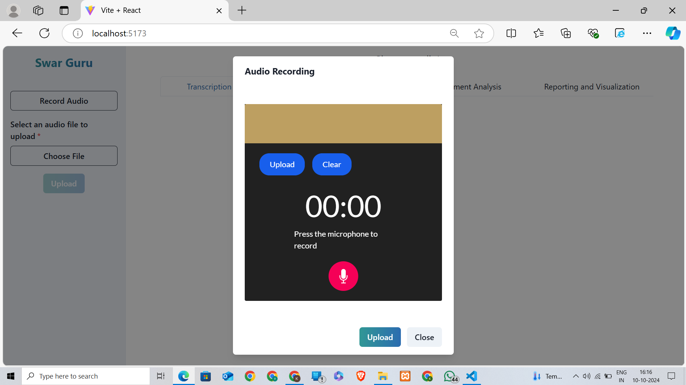
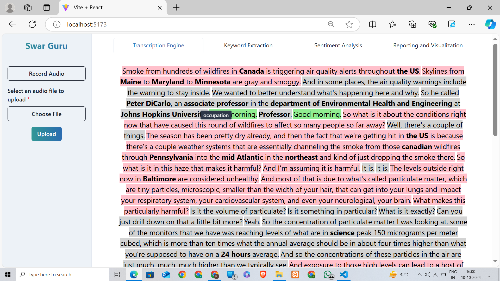
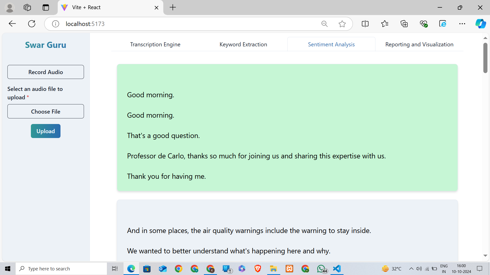
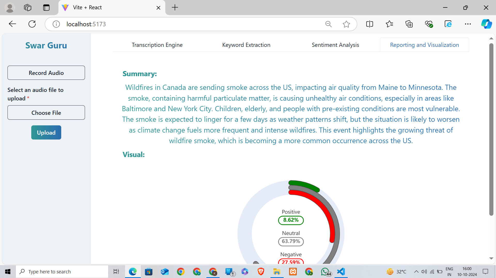
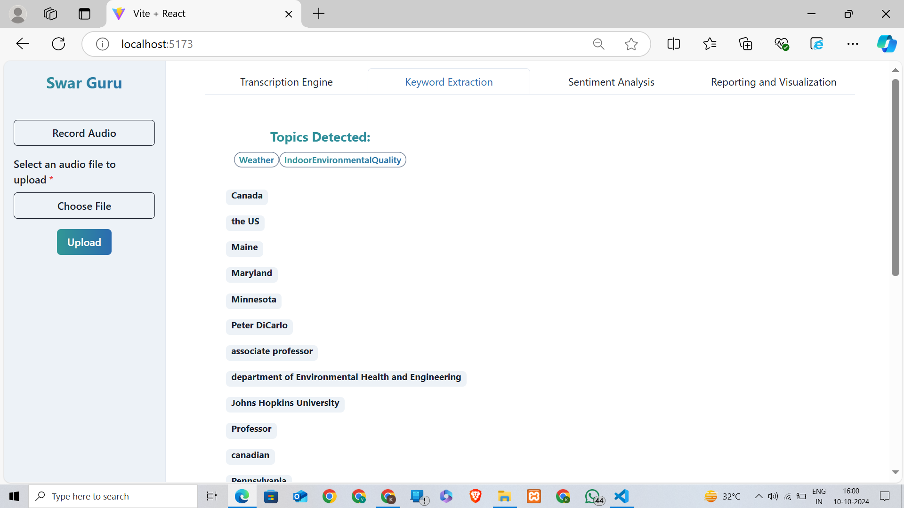

# Swar Guru

**Swar Guru** is an advanced audio analysis platform built with **React.js** and powered by APIs such as **Gemini API** and **AssemblyAI**. It provides various AI-powered tools to enhance your audio processing experience. The platform can transcribe audio, perform sentiment analysis, extract key phrases, summarize content, and generate visual insights into sentiment trends. With an intuitive interface and real-time processing, Swar Guru is designed to help users analyze and extract valuable insights from audio files.

## Features

- **Audio Transcription:** Converts audio files into text for easy readability and further analysis.
- **Sentiment Analysis:** Classifies sentences into positive, negative, or neutral categories to understand the emotional tone of the audio.
- **Keyword Extraction:** Extracts important keywords from the transcribed text to give a summary of the major topics discussed.
- **Summarization:** Generates concise summaries of the audio content.
- **Sentiment Chart Visualizations:** Displays pie and bar charts visualizing the distribution of positive, negative, and neutral sentiments in the audio.
  
## Screenshots


*Description: The dashboard overview of Swar Guru with options for uploading audio and accessing various analysis features.*


*Description: Example of audio transcription with keyword extraction.*


*Description: Sentiment analysis results showing positive, neutral, and negative sentiment classifications.*


*Description: Sentiment analysis chart displaying the percentage of positive, negative, and neutral sentences in the transcription.*



## How It Works

1. **Upload Audio:** Users can upload an audio file in formats such as `.mp3`, `.wav`, etc.
2. **Audio Transcription:** The uploaded audio is automatically transcribed into text using **AssemblyAI**.
3. **Sentiment Analysis:** Each sentence of the transcription is analyzed for sentiment using advanced **Gemini API**.
4. **Keyword Extraction:** The system identifies key phrases that summarize the core content of the audio.
5. **Summarization:** A brief summary of the audio is generated using **Gemini API**.
6. **Visual Charts:** The sentiment analysis results are displayed as interactive charts to visualize the emotional tone of the entire audio.

## Technologies Used

- **Backend:** 
  - Sentiment Analysis & Keyword Extraction: **Assembly API**
  - Audio Transcription: **AssemblyAI**
  - Summarization: **Gemini API**
- **Frontend:**
  - **React.js**
  - **echarts** for visualization
  - **Tailwind CSS** for responsive design
- **Hosting:**
  - Vercel for frontend deployment

## Setup Instructions

1. **Clone the Repository:**
    ```bash
    git clone https://github.com/kihan2518B/Swar_Guru.git
    ```

2. **Install Dependencies:**
    Navigate to the project folder and run:
    ```bash
    cd swar-guru
    npm install  # For frontend dependencies
    ```

3. **Setup API Keys:**
    - Add your **AssemblyAI API key**, **Gemini API key**, and other necessary API keys in the `.env` file.

4. **Run the Application:**
    - Start the backend server:
      ```bash
      python app.py
      ```
    - Start the frontend server:
      ```bash
      npm run dev
      ```

5. **Access the Application:**
   Open your browser and navigate to `http://localhost:3000` to start using Swar Guru.

## Contribution

Feel free to fork the repository and submit pull requests. Any contributions are welcome to improve functionality, fix bugs, or add new features.

## License

This project is licensed under the MIT License.
